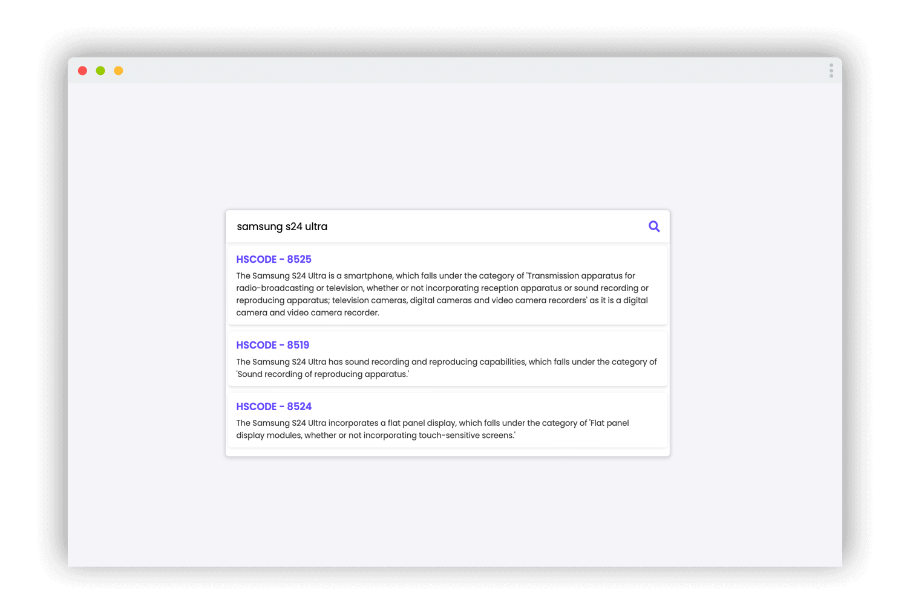
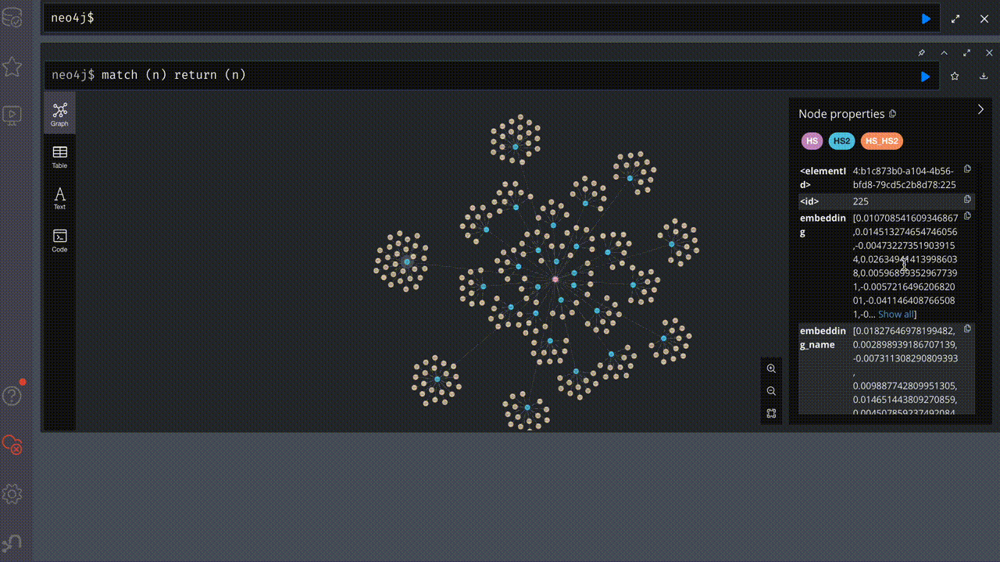
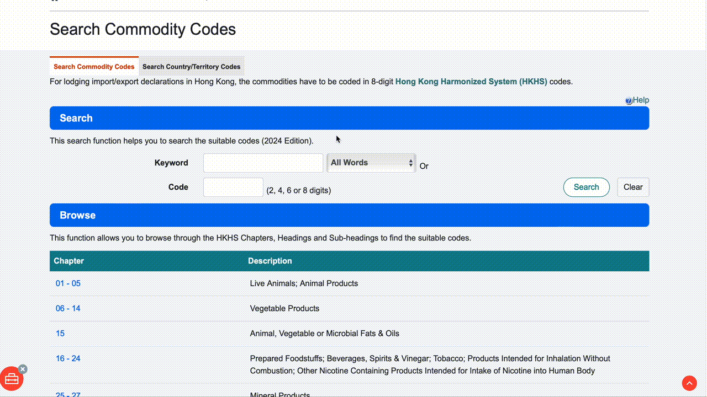

<!-- HEADER -->
<a id="readme-top"></a>

<br />
<div align="center">
  <a href="https://github.com/vinc1am/freight-hs-classifier">
    
  </a>

  <h3 align="center">Freight Commodity HS Code Classifier</h3>

  <p align="center">
    Streamlining shipping with automated HS code classification for freight cargo
    <br />
  </p>

  [![MIT License][license-shield]][license-url]
  [![Website][website-shield]][website-url]

</div>

<details>
  <summary>Table of Contents</summary>
  <ol>
    <li>
      <a href="#about-the-project">Overview</a>
    </li>
    <li>
      <a href="#getting-started">Installation</a>
    </li>
    <li><a href="#usage">Usage</a></li>
    <li><a href="#roadmap">Roadmap</a></li>
    <li><a href="#license">License</a></li>
    <li><a href="#acknowledgments">Acknowledgments</a></li>
  </ol>
</details>


<!-- Overview -->
## Overview



This application uses a Graph Database to find the most similar HS code definitions based on user input cargo descriptions. A Large Language Model (LLM) then selects the top match, ensuring accurate and efficient HS code classification, even for new products or misspelled words. This addresses the common pain point of manual HS code classification, which is often time-consuming and error-prone.

**Key Features Include:**

* Utilizes a **Graph Database** for matching similar HS code definitions.
* Employs a **LLM** to select the top match.
* Enhances identification of shipping cargo types 
* Reduces manual effort and errors.


<!-- GETTING STARTED -->
## Getting Started

Here are the instructions on setting up the project locally. To get a local copy up and running, please follow these steps:

### Installation

1. Register for the Neo4j Sandbox and obtain the credentials. Launch the Free Sandbox.
   ```sh
   https://neo4j.com/sandbox/
   ```
2. Clone the repo
   ```sh
   git clone https://github.com/vinc1am/freight-hs-classifier.git
   ```
3. Go to your project folder and install the required Python packages
   ```sh
   pip install -r requirements.txt
   ```
4. Rename the .env.template file to .env and update the credentials for Neo4j and Azure OpenAI
   ```sh
    NEO4J_URL=
    NEO4J_USERNAME=
    NEO4J_PASSWORD=
    AZURE_API_VERSION=
    AZURE_ENDPOINT=
    AZURE_EMBEDDING_DEPLOYMENT=
    AZURE_GPT_DEPLOYMENT=
    AZURE_API_KEY=
   ```
5. Build the Graph DB. This process will take around 30 minutes.
   ```sh
   cd src
   python build_graph_db.py
   ```
6. Execute the application
   ```sh
   uvicorn app:app --reload
   ```
7. Open your web browser and enter the following in the address bar
   ```sh
   localhost:8000
   ```


<!-- USAGE -->
## Usage

### Graph Database to Match Top HS Code Definitions

The application leverages a Graph Database to efficiently find the most similar HS code definitions based on the cargo descriptions provided by the user. When a user inputs a cargo description, the application queries the Graph Database, which contains a network of HS code definitions and their relationships. The Graph Database uses advanced algorithms to find HS code definitions that are most similar to the input description, considering factors such as synonyms, related terms, and contextual similarities. It then returns a list of the top HS code definitions that closely match the input description.




### LLM to Further Select the Best HS Code
Once the Graph Database has identified the top matching HS code definitions, the application employs a Large Language Model (LLM) to ensure the most accurate classification. The LLM reviews the list of top matches provided by the Graph Database and performs a deeper contextual analysis of the cargo description and the HS code definitions. It considers nuances, specific terms, and any potential misspellings or variations in the description. Based on its analysis, the LLM selects the best HS code that accurately represents the cargo, ensuring precise and reliable classification even for new products or descriptions with minor errors.



### Benefits
The combination of Graph Database and LLM enhances the identification of shipping cargo types, ensuring accurate classification. By automating the classification process, the application significantly reduces the manual effort required, saving time and resources. The advanced algorithms and contextual analysis minimize errors, providing reliable HS code classifications even for complex or new product descriptions. This application streamlines the HS code classification process, making it more efficient and accurate, and addressing a common pain point in the shipping and logistics industry.


<!-- ROADMAP -->
## Roadmap

- [x] Web scraping from the C&S Department HS Code dictionary
- [x] Building the Graph Database to store the HS Code dictionary
- [x] Implementing similarity search on the Graph Database
- [x] Integrating an LLM to select the best match from the candidate list provided by the Graph Database
- [x] User Interface


<!-- LICENSE -->
## License

Distributed under the MIT License. See `LICENSE.txt` for more information.


<!-- ACKNOWLEDGMENTS -->
## Acknowledgments

This project would not have been possible without the valuable resources and insights derived from the following sources:


* [Census and Statistics Department](https://www.censtatd.gov.hk/en/index_hs_code.html)
* [Neo4j](https://neo4j.com)
* [LangChain](https://www.langchain.com)

<p align="right" style="font-family:verdana;font-size:80%;color:blue"><b><a href="#readme-top" >Back to Top</a></b></p>


<!-- MARKDOWN LINKS & IMAGES -->
[license-shield]: https://img.shields.io/badge/License-MIT-yellow.svg
[license-url]: https://opensource.org/licenses/MIT
[website-shield]: https://img.shields.io/badge/Website-blue.svg
[website-url]: https://www.vinc1am.com
[linkedin-shield]: https://img.shields.io/badge/LinkedIn-blue.svg
[linkedin-url]: https://www.linkedin.com/in/vinc1am/

